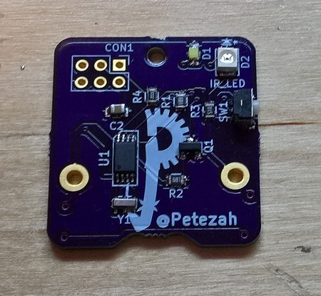

# roomba_wall_v3

An AVR device, based on ATTiny45, to transmit a virtual wall signal for an iRobot Roomba

## Folder layout

* /firmware
  * Source for the ATTiny45 firmware
* /hardware
  * Files describing the board layout, etc

## Building

### Prerequisites for "happy path":

* An AVR programmer
  * If you don't have one, you can build mine: https://oshpark.com/shared_projects/O24XLDbo
  * Though, this is a chicken-egg problem.  You can always program the programmer with an Arduino or a Raspberry Pi.
* AVR-GCC installed
  *  Easiest way to get this is 'sudo apt-get install arduino'
* A 6-position, dual-row IDC cable
* A 6-position, dual-row, male header to either:
  * Solder onto your board for programming, or
  * Plug into the IDC cable and "wedge" it into the ISP header during programming (recommended, and is what I do)

### Steps

#### hardware

* Order a board based on the files in https://github.com/Petezah/roomba_wall_v3/tree/master/hardware
  * Alternately, order one directly from OSH Park here: https://oshpark.com/shared_projects/i2FdXslA
* Purchase parts from [Mouser electronics](http://mouser.com) using the current BOM
  * Use the ones with "mouser" in their filenames
* Assemble the board--part references are all marked on the silkscreen
  * NB: The ISP header should not be soldered to the board--merely insert the header pins into the IDC cable and wedge the pins into the vias during programming

#### firmware

There are two methods to wire the board for programming:

* *Recommended way*:
  *  Order my AVR programmer board here: https://oshpark.com/shared_projects/O24XLDbo
  *  Assemble, and use an IDC cable as described above

* Alternate way: 
  *  Order my Raspberry Pi ISP board here: https://oshpark.com/shared_projects/iYtnPahC
  * Or hook up the ISP pins on the assembled board to your Raspberry PI as follows:
    * ISP Pin 1 --> Raspberry Pi Pin 21 (MISO)
    * ISP Pin 2 --> Raspberry Pi Pin 17 (3.3V)
    * ISP Pin 3 --> Raspberry Pi Pin 23 (SCK)
    * ISP Pin 4 --> Raspberry Pi Pin 19 (MOSI)
    * ISP Pin 5 --> Raspberry Pi Pin 15 (GPIO22)
    * ISP Pin 6 --> Raspberry Pi Pin 25 (GND)

Once wiring is accomplished:
* Execute the following on the Raspberry Pi command line
  * cd firmware
  * make fuse
  * make install

## Operating

There are a few different ways to operate this device.

### Default (easy) timed mode

When the device is off (sleeping), simply press and release the button once.  The device will respond by turning the indicator LED on for one second and then turning it off.  After this, the device will operate for 3 hours and then go to sleep again.

### Custom timed mode

When the device is off (sleeping), hold down the button.  The device will blink briefly, once every half second.  Every blink corresponds to 15 minutes of operation.  For example, if you want the device to operate for 30 minutes, you will wait for 2 blinks; or, if you want the device to operate for 1 hour and 15 minutes, you will wait for 5 blinks.  Once you reach the desired count, release the button.  The device will then wait, and will then blink the LED indicator the number of times it has counted for the running time.  After this, the device will run for the set time, and then will go to sleep.

### Turning off the device (putting it to sleep manually)

When the device is operating, hold down the button for two seconds.  The device will blink 3 times rapidly.  Now release the button, and the device will blink 2 times rapidly, and will then go to sleep.
